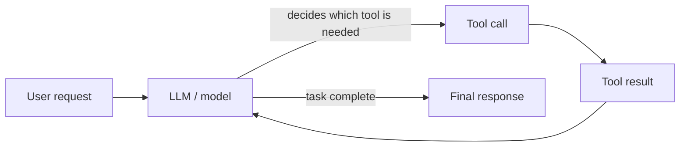

# Week 01 Questions

> Keep each answer concise (about 150-300 words for conceptual questions). Write in your own words.

## Q1 - AI → ML → Deep Learning → Generative AI → Agents

### A - Answer
<!-- Definitions of the 5 terms in your own words; one hierarchy/concept map (agents may sit outside the hierarchy); one everyday example per term; 3-5 closing sentences on generative model vs agentic system. -->

### E - Evidence
<!-- 2+ reliable source links; the diagram:  -->

### V - Verification
<!-- How did you check it? Which source did you use and what did you compare? -->

### R - Reflection
<!-- What did you learn? What could still go wrong? -->

---

## Q2 - Is Everything That Looks Intelligent Actually AI?

### A - Answer
No. A program is AI (more precisely, machine learning) when its behaviour
comes from patterns learned from data, not from rules a programmer wrote
explicitly. A rule-based or arithmetic program can look smart but only does
what its instructions say, and it will never improve or handle new cases
unless a person edits it.

### E - Evidence

| # | Scenario | Classification | Reason |
|---|---|---|---|
| A | Calculator: 25 × 16 = 400 | Traditional software (not AI) | Fixed arithmetic procedure; the same input always gives the same exact output |
| B | If temperature > 80°C, display WARNING | Traditional software (not AI) | A single explicit rule written by a programmer; nothing is learned from data |
| C | Spam detection learned from previous email data | Machine-learning AI | The model learned patterns from examples and is not given a hand-written list of rules |
| D | AI assistant writes a summary of a document | Generative AI | Produces new text rather than selecting a label or number |
| E | Navigation app predicts ETA from traffic and historical data | Machine-learning AI | Predicts a value using patterns learned from historical and live data (see Q8) |

**What makes an AI system different from a program that follows
explicit instructions?** In ordinary software, a person writes the rules
and the program applies them. In machine learning, a person provides data
and a training process finds the rules (patterns) itself. So an ML system
can handle situations nobody wrote a rule for, but it can also be wrong
in ways nobody planned for, and it needs testing.

### V - Verification
I checked my distinction between rules-based programs and learned models
against Quest global's Rules Based vs Machine Learning article and (https://resource.peopletech.com/blogs/rules-based-vs-machine-learning-which-is-right-for-your-business/).

### R - Reflection
Rows C and E both depend on the word "learned" or "historical data". If
the question had not said that, I could not have told them from rules by
looking at the output alone. Another limit: a rule-based program can also be
very complex, so complexity is not a test for AI.

---

## Q3 - What Happens When You Ask an LLM a Question?

### A - Answer
<!-- Intuitive explanation using: prompt, token, context, probability, next-token prediction, generated response; training vs inference in 1-2 sentences; why fluent text can be false. -->

### E - Evidence
<!-- Annotated flow diagram: Prompt → Tokens → Model processing → Probability distribution → Next token selection → Generated response; 1+ reliable technical/educational source. -->

### V - Verification
<!-- How did you check it? Which source did you use and what did you compare? -->

### R - Reflection
<!-- What did you learn? What could still go wrong? -->

---
## Q4 - Hallucination Experiment

### A - Answer
I asked two AI assistants the same multiplication question. Gemini gave the
correct result (185,998,593). ChatGPT gave a wrong result (186,070,593),
even though its intermediate steps were correct. So an AI can sound
confident and still be wrong.

### E - Evidence
**Prompt (exact wording):** What is 48,729 × 3,817? Give the exact result and show how you got it.

| Prompt | Model | Response summary | Verified claim | Evidence | Result | Lesson |
|---|---|---|---|---|---|---|
| (same prompt) | Gemini | Partial products, result 185,998,593 | 48,729 × 3,817 = 185,998,593 | Colab output 185998593 | Correct | better at maths but still verify in calculator |
| (same prompt) | ChatGPT | Same partial products, result 186,070,593 | Final sum 186,070,593 | Colab output 185998593 | Wrong (off by 72,000) | good with complexity but lacks basic maths |

Screenshot: 

### V - Verification
I ran `48729 * 3817` in Google Colab (Python) and compared it with both
answers. I also re-added ChatGPT's own partial products by hand
(146,187,000 + 38,983,200 + 487,290 + 341,103) and got 185,998,593, so the
error was in its final addition, not in the steps.

### R - Reflection
+ Initial steps are correct so final answer too looks correct , which is not 
+ Never jump to conclusion depending on what the model is!
+ Always use calculator for verification
---
## Q5 - AI Assistant vs Search vs Authoritative Reference

### A - Answer
I asked the same question using an AI assistant, a web search, and the
RFC Editor. [State which method gave the most reliable and traceable
answer, and whether any method gave an outdated or incorrect detail.]

### E - Evidence
**Question (exact wording):** How many bits long is an IPv6 address, and
which RFC currently defines the IPv6 protocol specification?

| Method | What I found | Accuracy | Explanation | Traceability | Ease of verification |
|---|---|---|---|---|---|
| AI assistant (Chatgpt) | 128bit length and RFC 8200 | Wrong  | clear and detailed | cited RFC 8200 | Very easy to check |
| Web search | messy websites | Ai overview was clear but still the top websites have no clear data| no clear data| no clarity |  hard to search|
| Authoritative reference (RFC Editor) | [number of bits;128 current RFC number;2460 | rfc-editor.org | dense and technical | official | easy and one page |

**Authoritative reference link:** https://www.rfc-editor.org/rfc/rfc8200.html?utm_source=chatgpt.com

**Differences found:** while the Ai assistant and web search agreed the same but still the RFC editor proved them wrong 

### V - Verification
I treated the RFC Editor page as the reference and compared the AI and
search answers against it.  While the Ai assistant and web search agreed the same but still the RFC editor proved them wrong

### R - Reflection
+ I would use different  methods to specific tasks : AI for quick explanation, search for
discovery, primary source before making any decision that depends on the
exact fact.
+ For fact search I would go  for the primary search instead of AI assistant or Web search
  
---

## Q6 - What Is an AI Agent?

### A - Answer
An LLM is the model itself: it takes text in and generates text out. An
agent is a system built around an LLM that can decide which tools to use,
act, look at the result, and keep going until the task is done. A simple
chatbot only replies; an agent can act and adapt.

The difference is control: in a chatbot I decide every step, while in an
agent the model decides the next step based on what happened before.

### E - Evidence

| Concept | In my own words | Can it use external data or tools? | Who decides the steps? |
|---|---|---|---|
| LLM | A trained language model that generates text from a prompt | No, only what it learned in training and what is in the prompt | Nobody; it just produces output |
| LLM application | A product built around an LLM, such as a chat app with a system prompt and interface | Usually limited | The developer's fixed design |
| RAG system | An LLM plus a retrieval step: it first fetches relevant documents and puts them in the prompt before answering | Yes, reads from a document store | A fixed pipeline (retrieve, then generate) |
| Tool-using assistant | An LLM that can call tools such as search, a calculator or an API when it needs them | Yes | The model chooses a tool, but usually for a single request |
| AI agent | An LLM that works in a loop: plan, call tools, read results, decide the next step, and stop when finished | Yes | The model, across multiple steps |

**Architecture diagram**

Text version: User request → Model → Tool call → Tool result → Model decides
(call another tool, or finish) → Final response.

**Everyday agentic workflow (non-VLSI):** a travel-planning agent. The user
says "Plan a 2-day trip to Mysuru under ₹10,000." The agent searches
train and bus timings, checks hotel prices, notices the first option goes
over budget, searches again for a cheaper hotel, then returns a final
itinerary. A plain chatbot would write one generic itinerary without
checking real prices.

### V - Verification
I compared my definitions with Anthropic. It describes workflows follow predefined code paths, while agents let the
model direct its own process and tool use. My table matches this. Some
terms (such as "agent") are used loosely, and companies define them
differently, so I focused on the behaviour: does the system loop, use
tools, and choose its own next step?

### R - Reflection
The main thing I learned is that "agent" describes how a system is built,
not a different kind of model. The same LLM can power a chatbot or an
agent. What could go wrong: an agent can make a wrong decision, or call a
tool with the wrong input, and each mistake can carry into the next step.
This is why Q7 matters: a human needs to check consequential actions.

---

## Q7 - Where Should Humans Still Make the Decision?

### A - Answer
Even if an AI can read documents, answer questions, summarize and suggest
actions, I would still require a human to inspect and approve its output in
any situation where a wrong answer is costly, hard to reverse, affects other
people, or cannot be checked by the AI itself. The AI can help me prepare a
decision, but the responsibility for the result stays with a person.

### E - Evidence

| # | Situation | Possible failure | Required verification | Who/what approves |
|---|---|---|---|---|
| 1 | AI summarizes a medical report or prescription instructions | Misses or invents a detail such as a dosage or an allergy warning, and the patient is harmed | Compare with the original document; confirm with official drug information | Doctor or pharmacist |
| 2 | AI drafts a legal or contract clause | Wrong wording, missing obligations, or a clause that does not apply in my jurisdiction | Read the full text; compare with the applicable law or a template from a trusted source | Qualified lawyer |
| 3 | AI suggests a financial action, such as moving money or choosing an investment | Outdated or invented numbers, ignoring my risk and personal situation, loss that cannot be recovered | Check figures against official statements and market data; understand the risks | Me, with a financial advisor for large decisions |
| 4 | AI generates code or a script that will be run on a shared or production system | Bug, security hole, or a destructive command (such as deleting files) | Read every line; run it on a test copy first; use version control and review | Another engineer or code reviewer |
| 5 | AI writes a factual report or an email that will be sent under my name | Fabricated facts or citations, wrong tone, or leaking confidential details | Check each claim against a source; remove sensitive information | Me, before sending (my manager for official documents) |

**Simple rule:** The more serious and irreversible the consequence, the less
I should accept AI output without checking, and the more independent the check
must be.

### V - Verification
I chose situations where the cost of an error is high and where I can name a
concrete failure, instead of generic risks.

### R - Reflection
The pattern I noticed is that the AI is most dangerous when its answer looks
complete and I have no easy way to check it. What could still go wrong is
automation bias: I might start trusting the AI because it was right
several times, and stop checking. I will treat approval as a real step
with a named person, not a formality.

---
## Q8 - Find AI Around You

### A - Answer
Of the five everyday systems I examined, Google Maps ETA, the Gmail spam
filter and Face ID have public evidence of machine learning. Washing machine
and Fridge have no public technical evidence" or "appear rule-based". Being automated or sounding smart is
not enough to call something AI.

### E - Evidence

| System | AI/ML involved? | Task type | Evidence / source | My conclusion |
|---|---|---|---|---|
| Google Maps ETA | Yes | Prediction (travel time) | DeepMind blog (2020): travel time predicted by a Graph Neural Network model. https://deepmind.google/blog/traffic-prediction-with-advanced-graph-neural-networks/ | Uses ML, as of the 2020 description; I cannot confirm today's internals |
| Gmail spam filter | Yes (together with rules) | Classification (spam / not spam) | Google Workspace blog: ML models block spam and phishing with over 99.9% accuracy. https://workspace.google.com/blog/product-announcements/keeping-your-company-data-safe-new-security-updates-gmail | Uses ML, combined with rules-based protections |
| Face ID | Yes | Recognition / classification (match or no match, plus spoof detection) | Apple Platform Security: facial matching uses neural networks in the Secure Enclave. https://support.apple.com/guide/security/sece151358d1/web | Uses neural networks, per Apple's own documentation |
| Washing machine | Not enough public evidence to conclude | Automation | "none found" | Predefined stages are being automated as there is no loop for checking the cleanliness of the cloths  |
| Fridge | Not enough public evidence to conclude | Freezing | "non found" | Predefined stages are being automated as there is no loop for checking the cleanliness of the cloths    | |

**Could a simpler rule-based approach do the same?** Take Gmail spam. A
rule such as "block emails containing 'free money'" catches obvious spam,
but spammers change wording, use images, and send from newly created
domains, so fixed rules need constant manual updating. Google describes
using both ML and rules together, which suggests rules alone are not
enough at this scale. 

### V - Verification
I opened each source and checked that it names the technique (neural
network or machine learning) for that specific feature. Company blogs and
documentation are primary sources for what the company says, but they do
not let me inspect the system independently. 

### R - Reflection
The main lesson is to separate "the product works smartly" from "the
maker says it uses ML." Public evidence usually tells me the technique,
not the internal details, and some of it is several years old. What could
go wrong: a company could change the system later, or use marketing terms
like "AI-powered" for ordinary rules. For those cases I will write "Not
enough public evidence to conclude" instead of guessing.

---

## Q9 - Prediction, Classification, and Generation

### A - Answer
I classified each example by its primary output. Prediction means
estimating a value or a future outcome. Classification means choosing
one label from a set of categories. Generation means producing new
content such as text or images. Several real systems mix these, so I
note a caveat where it matters. Next-token prediction is the basic
mechanism behind modern language models: writing, summarizing, coding
and question answering are all done by predicting one token at a time.

### E - Evidence

| # | Example | Primary type | Reason | Caveat |
|---|---|---|---|---|
| A | Predicting house prices | Prediction | Output is a numeric value estimated from features such as size and location | Technically called regression |
| B | Detecting whether an image contains a cat | Classification | Output is a label: cat or not cat | Image-recognition models are often built with deep learning |
| C | Writing an email from a short instruction | Generation | Produces new text that did not exist before | Quality depends on the prompt; may contain errors |
| D | Predicting whether a customer will cancel a subscription | Prediction | Estimates a future behaviour from past customer data | Technically a yes/no classifier that outputs a probability, so it also fits Classification |
| E | Summarizing a research paper | Generation | Writes new, shorter text based on the input | May leave out or distort details; needs checking against the paper |
| F | Identifying whether a transaction is fraudulent | Classification | Assigns each transaction a label: fraud or legitimate | Often combines classification with anomaly detection and rules |
| G | Generating an image from a text description | Generation | Creates a new image that matches the prompt | Does not guarantee the image is accurate or realistic |
| H | Predicting the next word/token in a sentence | Prediction | Estimates which token is most likely to come next | Technically choosing among all tokens in a vocabulary, and it is the building block of text generation |

**Why next-token prediction is fundamental.** A language model is trained
on huge amounts of text to predict the next token from the tokens before
it. To generate a response, it predicts one token, adds it to the context,
and predicts the next, repeating until the response is complete. Writing
an email, summarizing, coding and answering questions are all just
different kinds of text, so the same mechanism handles them. The prompt
tells the model which kind of text to continue. To predict well across
many kinds of text, the model has to pick up grammar, facts and patterns
of reasoning from its training data. This also explains hallucination
(Q4): the model produces the most likely-sounding continuation, not
necessarily a verified fact.

### V - Verification
I checked my definitions of prediction (regression), classification and
generation against Medium (https://medium.com/@magtk/classification-regression-and-prediction-what-is-the-difference-7d10447e6181).

### R - Reflection
The categories overlap more than I expected: churn and fraud both
output a label, but one looks forward in time and the other is a
decision about a current case. I learned that the label I choose depends
on how the system's output is used. A thing I am not sure about is how chat models are adjusted after
the basic training. Real products usually combine several task types,
so a single label is only a simplification.

---

## Q10 - Design Your Personal AI Verification Protocol

### A - Answer
Before I accept any AI-generated result, I follow this 7-step protocol.

1. **Define the problem and what "correct" means.**
2. **Record the exact prompt, tool and answer.**
3. **Inspect the assumptions.**
4. **Check the evidence and sources.**
5. **Test the result independently.**
6. **Cross-check important results (second tool or person).**
7. **Decide: accept, reject or revise, and document why.**

### E - Evidence

| Step | Why it exists | Failure it catches |
|---|---|---|
| 1. Define the problem and the success criteria | I cannot judge an answer if I have not decided what a good answer looks like | Vague questions, an answer that solves a different problem, no way to tell right from wrong |
| 2. Record the exact prompt, tool and answer | Lets me and others reproduce and review what happened | Lost context, "it worked yesterday" claims, an answer that changes when I paraphrase my question |
| 3. Inspect the assumptions | AI fills gaps silently, for example a version, a unit, a location or a date | Hidden or wrong assumptions, outdated information, answers that are true only in a different setting |
| 4. Check the evidence and sources | A fluent answer is not proof; I need a primary or reliable source for important claims | Invented facts or citations, confident but unsupported statements |
| 5. Test the result independently | Where possible I run, calculate or measure it instead of trusting the explanation | Wrong arithmetic, code that does not run, correct-looking steps with a wrong conclusion |
| 6. Cross-check important results | A second tool, a source or a person can disagree, and disagreement is information | Errors that one assistant makes consistently, my own blind spots |
| 7. Decide accept / reject / revise, and document | The decision is mine, and a written record keeps me honest | Accepting by default, repeating the same mistake, not knowing later why I trusted something |

**Worked example (non-VLSI): the multiplication from Q4.**
1. *Define:* I need the exact value of 48,729 × 3,817; correct means it matches an exact calculation.
2. *Record:* prompt and both answers saved (ChatGPT: 186,070,593; Gemini: 185,998,593).
3. *Assumptions:* I assumed plain integer multiplication, no rounding, and that "show your work" would make the answer reliable.
4. *Evidence:* a calculation is the right evidence here, so I used Python rather than a website.
5. *Test:* Python printed 185998593. I also re-added ChatGPT's partial products and got the same value.
6. *Cross-check:* the two assistants disagreed, which showed that at least one was wrong.
7. *Decide:* **Reject** ChatGPT's total, **accept** Gemini's, and log both in the verification log.
The protocol caught an error that looked trustworthy because the steps were correct and the layout was neat.

### V - Verification
I tested the protocol against my own Q4 result, and it identified the wrong answer. I also compared it with the source hierarchy in the course handout (primary sources first, AI as an aid but not an authority).
### R - Reflection

The protocol is written for tasks that have an answer I can test.
For judgement questions (like a forecast), steps 4 and 6 matter more
and step 5 may be impossible, so I would label the result "unverified".
It also takes time, so I will scale the effort to the risk: a quick
check for low-stakes questions, the full seven steps for decisions with
consequences (see Q7). At the end of the 16 weeks I will revisit this and
add what I learn, particularly about testing code and handling
agent workflows.

---

